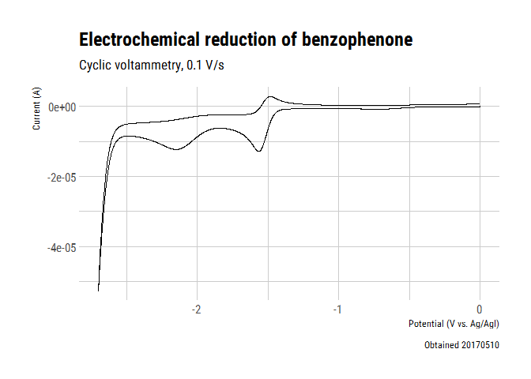

This is an [R Markdown](http://rmarkdown.rstudio.com) Notebook. When you
execute code within the notebook, the results appear beneath the code.

First load the tidyverse

    library(tidyverse)
    library(hrbrthemes)

CV of benzophenone
------------------

    data <- read_csv('data/CV4 2mM benzophenone.txt', col_names = c('Pot', 'Cur'), skip = 30)

    ## Parsed with column specification:
    ## cols(
    ##   Pot = col_double(),
    ##   Cur = col_double()
    ## )

    data %>% ggplot(aes(Pot, Cur)) +
      geom_path() +
      labs(x = "Potential (V vs. Ag/AgI)", y = "Current (A)", title = "Electrochemical reduction of benzophenone",
        subtitle = "Cyclic voltammetry, 0.1 V/s", caption = "Obtained 20170510") +
      theme_ipsum_rc()

